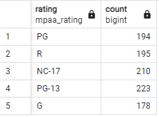
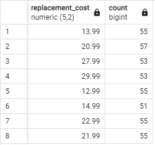
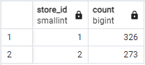
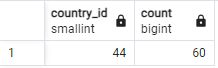

1. SELECT rating, COUNT(*) FROM film
   GROUP BY rating;

   

2. SELECT replacement_cost, COUNT(*) FROM film
   GROUP BY replacement_cost
   HAVING COUNT(*) > 50;

   

3. SELECT store_id, COUNT(*) FROM customer
   GROUP BY store_id;

   

4. SELECT country_id, COUNT(*) FROM city
   GROUP BY country_id
   ORDER BY COUNT(*) DESC
   LIMIT 1;

   